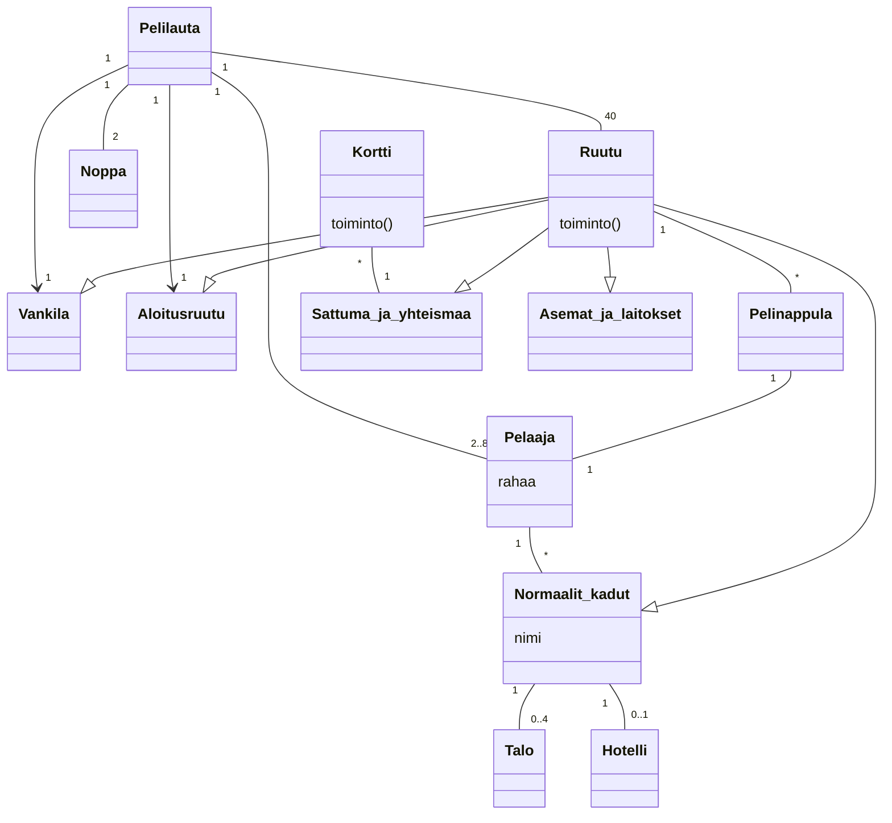

```mermaid
 classDiagram
      Pelilauta "1" -- "2..8" Pelaaja
      Pelilauta "1" -- "40" Ruutu
      Pelilauta "1" -- "2" Noppa
      Pelilauta "1" --> "1" Vankila
      Pelilauta "1" --> "1" Aloitusruutu 
      Ruutu "1" -- "*" Pelinappula
      Pelinappula "1" -- "1" Pelaaja
      Pelaaja "1" -- "*" Normaalit_kadut
      Normaalit_kadut "1" -- "0..4" Talo
      Normaalit_kadut "1" -- "0..1" Hotelli
      Kortti "*" -- "1" Sattuma_ja_yhteismaa
      Ruutu --|> Aloitusruutu
      Ruutu --|> Vankila
      Ruutu --|> Sattuma_ja_yhteismaa
      Ruutu --|> Asemat_ja_laitokset
      Ruutu --|> Normaalit_kadut
      
      
      
      
      class Kortti{
          toiminto()
      }
      class Pelaaja{
          rahaa
      }
      class Ruutu{
          toiminto()
      }
      class Normaalit_kadut{
          nimi
      }
```
